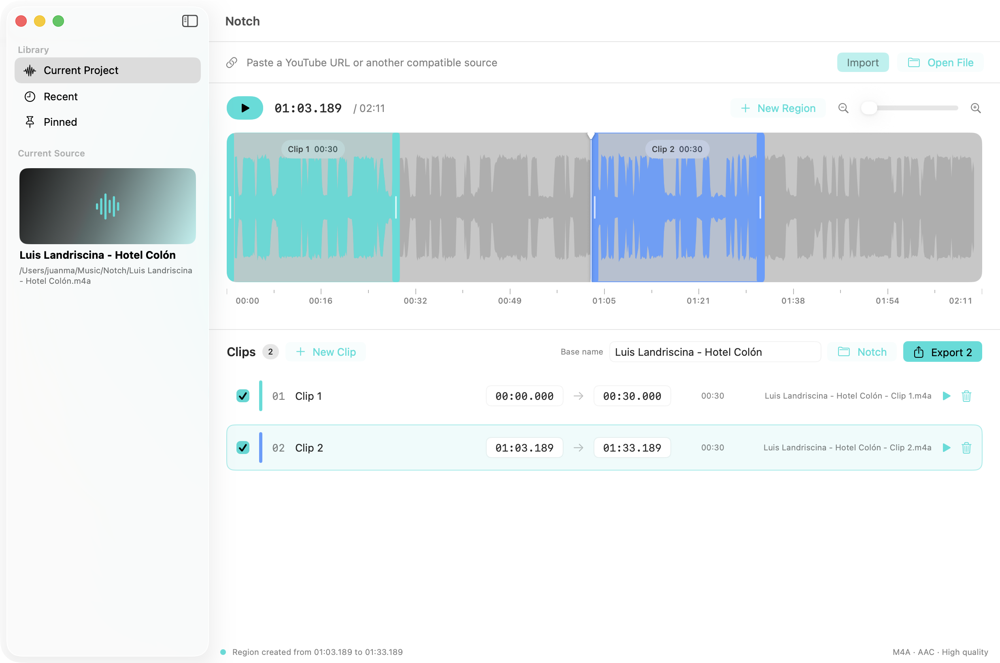
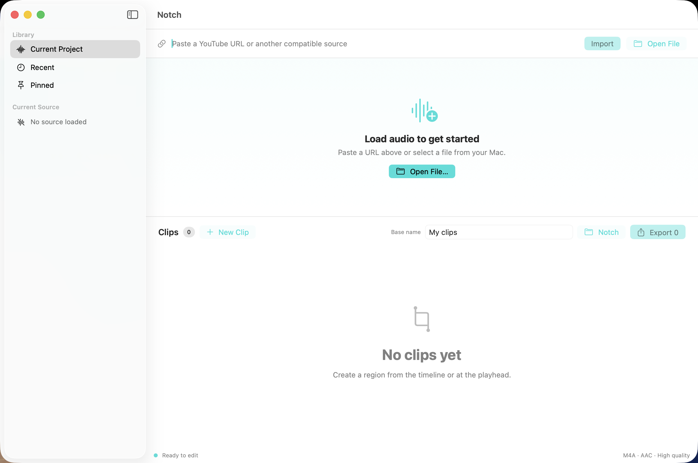
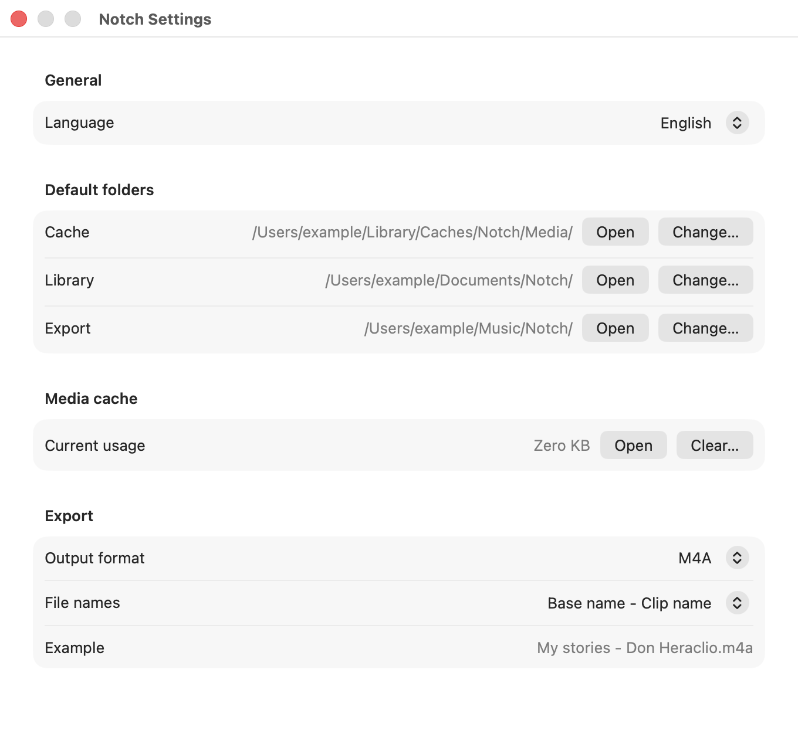

# Notch

[](https://github.com/jmouriz/notch/actions/workflows/ci.yml)
[](LICENSE)
[](https://www.apple.com/macos/)

Notch is a native macOS audio splitter for importing local media or YouTube
audio, selecting multiple regions directly on a waveform, previewing them, and
exporting each clip as a separate file.



## Features

- Import local audio and video files.
- Download audio from YouTube with the bundled `yt-dlp`.
- Configurable media cache to avoid repeated downloads.
- Real waveform visualization with zoom, playhead, and playback controls.
- Create regions by dragging directly on the timeline.
- Move regions and adjust their start and end handles visually.
- Enter exact timestamps and individual clip names.
- Preview any region before exporting.
- Export to M4A, MP3, or WAV.
- Choose from three configurable file and folder naming conventions.
- Save all project metadata in portable `.notch` JSON files.
- Browse recent and pinned projects from the built-in library.
- Configure default cache, library, and export folders.
- Use the interface in English, Spanish, or Portuguese, with automatic system
  language detection and an in-app language selector.

## Screenshots

| Start screen | Settings |
| --- | --- |
|  |  |

## Requirements

- macOS 14 Sonoma or later.
- Apple Silicon for the current prebuilt distribution.
- Xcode with Swift 6 to build from source.

## Run from source

```bash
git clone https://github.com/jmouriz/notch.git
cd notch
swift run Notch
```

You can also open `Package.swift` directly in Xcode and run the `Notch`
scheme.

## Tests

```bash
swift test
```

The test suite covers local import, YouTube cache lookup, playback, timeline
hit testing, manual time editing, project persistence, the project library,
preferences, localization, and real audio exports.

## Build the app and DMG

```bash
./Packaging/package-release.sh
```

The packaging script creates:

```text
build/Notch.app
build/Notch-0.1.0.dmg
```

Development builds use ad hoc code signing. Public distribution requires an
Apple Developer ID certificate and notarization.

## Keyboard shortcuts

| Action | Shortcut |
| --- | --- |
| New project | `⌘N` |
| Open project | `⌘O` |
| Open audio or video | `⇧⌘O` |
| Save project | `⌘S` |
| Save project as | `⇧⌘S` |
| Settings | `⌘,` |
| New region | `⌘R` |
| Preview selected region | `Space` |

## Included components

- [yt-dlp](https://github.com/yt-dlp/yt-dlp), released under The Unlicense.
- [LAME](https://lame.sourceforge.io/), released under the GNU LGPL 2.0.

FFmpeg is not bundled or invoked by this version. M4A and WAV exports use the
native macOS media frameworks. See [THIRD_PARTY_NOTICES.md](THIRD_PARTY_NOTICES.md)
for notices and full license texts.

## License

Notch is released under the [MIT License](LICENSE).

Copyright © 2026 Juan Manuel Mouriz.
